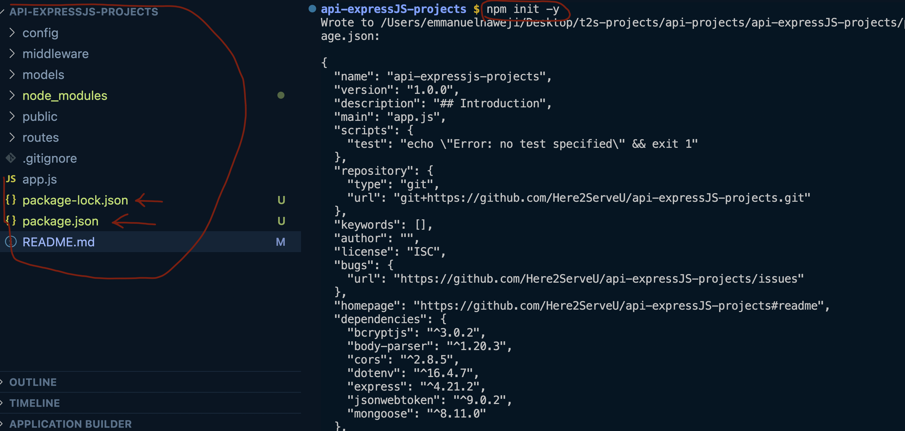
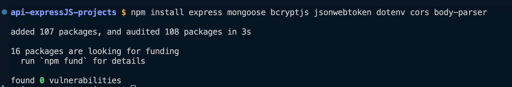
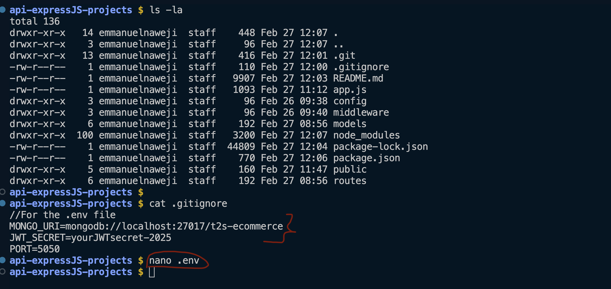
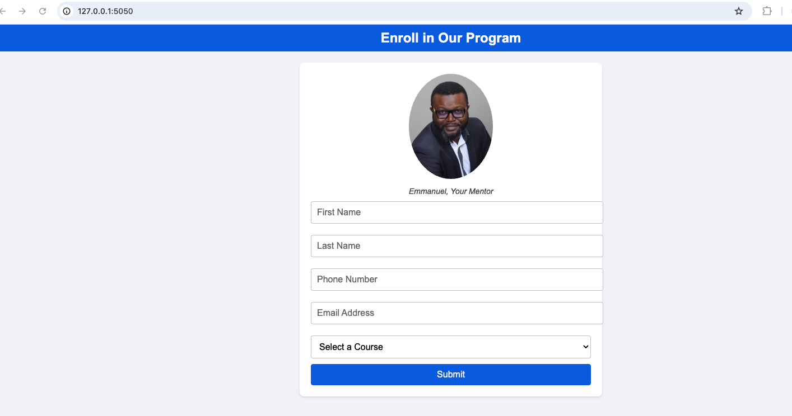
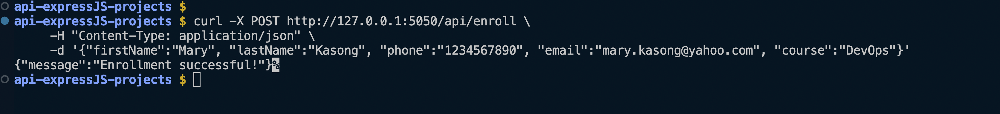
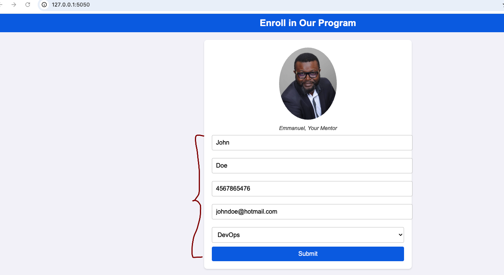
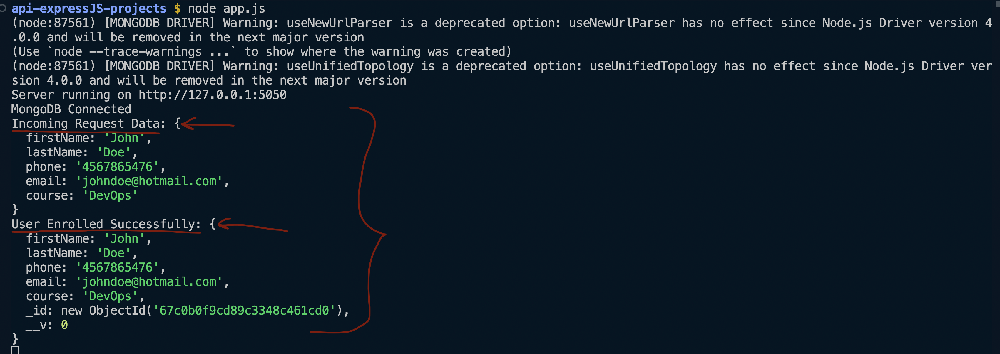
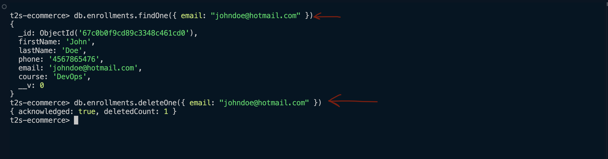

# Building a RESTful E-commerce API for T2S Services with Node.js and Express

## Introduction

E-commerce platforms like **Amazon, Shopify, and BigCommerce** rely on APIs to handle **user authentication, product management, and order processing**. 
This guide demonstrates how to build **a real-world RESTful API** for **T2S Services** using **Node.js, Express, and MongoDB**. The API will support **user registration, product catalog management, and secure order processing**.

---

## Use Cases
### 1. User Authentication & Authorization
- **Users can register and log in** securely with hashed passwords and JWT authentication.
- **Admins can manage products**, ensuring only authorized users can create or modify items.

### 2. Product Management
- Retrieve **a list of products** from the database.
- **Admins can add, update, and delete** products dynamically.

### 3. Order Processing & Inventory Management
- Users can **place orders** for available products.
- The API automatically **deducts stock** after a successful purchase.


---

## Step 1: Set Up Your Express.js Project
### 1: Set Up the Project

- Run the following in your terminal: 
```bash
mkdir t2s-ecommerce-api
cd t2s-ecommerce-api
npm init -y
```
- This will create a **package.json** file. 



### 2: Install Dependencies
```bash
npm install express mongoose bcryptjs jsonwebtoken dotenv cors body-parser
```
- **express**: Web framework for APIs.
- **mongoose**: MongoDB ODM for database operations.
- **bcryptjs**: Password hashing for authentication. 
- **jsonwebtoken**: Secure authentication with JWT. 
- **dotenv**: Environment variables. 
- **cors**: Cross-Origin Resource Sharing. 
- **body-parser**: Parse incoming JSON requests. 



---
## Step 2: Project Structure
```plaintext
t2s-ecommerce-api/
│── config/
│   ├── db.js
│── models/
│   ├── Enrollment.js
│   ├── User.js
│   ├── Product.js
│   ├── Order.js
│── public/
│   ├── Emmanuel-N.JPG
│   ├── index.html
│   ├── script.js
│   ├── styles.css
│── routes/
│   ├── Enrollment.js
│   ├── userRoutes.js
│   ├── productRoutes.js
│   ├── orderRoutes.js
│── middleware/
│   ├── authMiddleware.js
│── screenshots/
│── app.js
│── .env
│── package.json
│── README.md
```
---
## Step 3: Configure MongoDB Connection (config/db.js)

```javascript
const mongoose = require("mongoose");

const connectDB = async () => {
    try {
        await mongoose.connect(process.env.MONGO_URI, {
            useNewUrlParser: true,
            useUnifiedTopology: true,
        });
        console.log("MongoDB Connected");
    } catch (error) {
        console.error("MongoDB Connection Error:", error);
        process.exit(1);
    }
};

module.exports = connectDB;
```
---
## Step 4: Define Models

### 1. User Model (models/User.js)
```javascript
const mongoose = require("mongoose");

const UserSchema = new mongoose.Schema({
    username: { type: String, required: true, unique: true },
    password: { type: String, required: true },
    isAdmin: { type: Boolean, default: false }
});

module.exports = mongoose.model("User", UserSchema);
```

### 2. Product Model (models/Product.js)
```
const mongoose = require("mongoose");

const ProductSchema = new mongoose.Schema({
    name: { type: String, required: true },
    description: { type: String, required: true },
    price: { type: Number, required: true },
    stock: { type: Number, required: true }
});

module.exports = mongoose.model("Product", ProductSchema);
```

### 3. Order Model (models/Order.js)
```javascript
const mongoose = require("mongoose");

const OrderSchema = new mongoose.Schema({
    userId: { type: mongoose.Schema.Types.ObjectId, ref: "User", required: true },
    productId: { type: mongoose.Schema.Types.ObjectId, ref: "Product", required: true },
    quantity: { type: Number, required: true },
    totalPrice: { type: Number, required: true },
});

module.exports = mongoose.model("Order", OrderSchema);
```

### 4. Enrollment Model (models/Enrollment.js)
```javascript
const mongoose = require("mongoose");

const EnrollmentSchema = new mongoose.Schema({
    firstName: { type: String, required: true },
    lastName: { type: String, required: true },
    phone: { type: String, required: true },
    email: { type: String, required: true, unique: true },
    course: { type: String, required: true }
});

module.exports = mongoose.model("Enrollment", EnrollmentSchema);
```

---

## Step 5: Middleware for Authentication (middleware/authMiddleware.js)
```javascript
const jwt = require("jsonwebtoken");

const authMiddleware = (req, res, next) => {
    const token = req.header("Authorization")?.split(" ")[1];

    if (!token) return res.status(401).json({ message: "Unauthorized" });

    try {
        const decoded = jwt.verify(token, process.env.JWT_SECRET);
        req.user = decoded;
        next();
    } catch (error) {
        res.status(401).json({ message: "Invalid token" });
    }
};

module.exports = authMiddleware;
```

---
## Step 6: Create API Routes

### 1. User Authentication (routes/userRoutes.js)
```javascript
const express = require("express");
const bcrypt = require("bcryptjs");
const jwt = require("jsonwebtoken");
const User = require("../models/User");

const router = express.Router();

router.post("/register", async (req, res) => {
    const { username, password } = req.body;
    const hashedPassword = await bcrypt.hash(password, 10);

    const newUser = new User({ username, password: hashedPassword });
    await newUser.save();

    res.status(201).json({ message: "User created successfully" });
});

router.post("/login", async (req, res) => {
    const { username, password } = req.body;
    const user = await User.findOne({ username });

    if (!user || !(await bcrypt.compare(password, user.password))) {
        return res.status(401).json({ message: "Invalid credentials" });
    }

    const token = jwt.sign({ id: user._id, isAdmin: user.isAdmin }, process.env.JWT_SECRET, { expiresIn: "1h" });
    res.json({ token });
});

module.exports = router;
```

### 2. Product Management (routes/productRoutes.js)
```javascript
const express = require("express");
const Product = require("../models/Product");
const authMiddleware = require("../middleware/authMiddleware");

const router = express.Router();

router.get("/", async (req, res) => {
    const products = await Product.find();
    res.json(products);
});

router.post("/", authMiddleware, async (req, res) => {
    const newProduct = new Product(req.body);
    await newProduct.save();
    res.status(201).json({ message: "Product added successfully" });
});

module.exports = router;
```

### 3. Order Processing (routes/orderRoutes.js)
```javascript
const express = require("express");
const Order = require("../models/Order");
const Product = require("../models/Product");
const authMiddleware = require("../middleware/authMiddleware");

const router = express.Router();

router.post("/", authMiddleware, async (req, res) => {
    const { productId, quantity } = req.body;
    const product = await Product.findById(productId);

    if (!product || product.stock < quantity) {
        return res.status(400).json({ message: "Not enough stock" });
    }

    const totalPrice = product.price * quantity;
    const newOrder = new Order({ userId: req.user.id, productId, quantity, totalPrice });

    product.stock -= quantity;
    await product.save();
    await newOrder.save();

    res.status(201).json({ message: "Order placed successfully" });
});

module.exports = router;
```

### 4. Enrollment (routes/enrollmentRoutes.js)
```javascript
const express = require("express");
const Enrollment = require("../models/Enrollment");

const router = express.Router();

// POST route to handle enrollments
router.post("/enroll", async (req, res) => {
    try {
        console.log("Incoming Request Data:", req.body); // Log the received data

        const { firstName, lastName, phone, email, course } = req.body;

        // Check if all fields are provided
        if (!firstName || !lastName || !phone || !email || !course) {
            return res.status(400).json({ message: "All fields are required." });
        }

        // Save to database
        const newEnrollment = new Enrollment({ firstName, lastName, phone, email, course });
        await newEnrollment.save();

        console.log("User Enrolled Successfully:", newEnrollment);
        res.status(201).json({ message: "Enrollment successful!" });

    } catch (error) {
        console.error("❌ Error enrolling user:", error);
        res.status(500).json({ message: "Internal Server Error", error: error.message });
    }
});

module.exports = router;
```

---

## Step 7: Set Up Express (app.js)
```javascript
require("dotenv").config();
const express = require("express");
const connectDB = require("./config/db");

const userRoutes = require("./routes/userRoutes");
const productRoutes = require("./routes/productRoutes");
const orderRoutes = require("./routes/orderRoutes");

const app = express();
app.use(express.json());

connectDB();

app.use("/api/users", userRoutes);
app.use("/api/products", productRoutes);
app.use("/api/orders", orderRoutes);

app.get("/", (req, res) => {
    res.send("Welcome to T2S E-Commerce API");
});

const PORT = process.env.PORT || 5050;
app.listen(PORT, () => console.log(`Server running on http://127.0.0.1:${PORT}`));
```

- If running MongoDB **locally**, do the following: 

   - Create the **.env** if it does not exist.
```bash
ls -la    # To verify if the .env exists. 
touch .env # To create the .env file
```
    - Add the following content to the **.env** file:
```plaintext
# Database Connection
MONGO_URI=mongodb://localhost:27017/t2s-ecommerce

# Authentication & Security
JWT_SECRET=yourJWTsecret-2025

# Server Configuration
PORT=5050

# CORS Setup (Optional)
CORS_ORIGIN=*

# Debugging & Logging
NODE_ENV=development
```
- A little different from what you see on the screenshot below. But, basically, you need to determine the values for MONGO_URI, JWT_SECRET and PORT.

---

## Step 8: Re-Install Dependencies in Case of Errors
```bash
npm install express # To install Express
npm list express    # To verify Express
```

- Delete node_modules and Reinstall
```bash
rm -rf node_modules package-lock.json
npm install
```
- Now go to **Step 9**. 
---
## Step 9: Run the API

**1. Start MongoDB (if using local setup)**
- Install MongoDB
```bash
# For macOS (Using Homebrew)
brew tap mongodb/brew
brew install mongodb-community@7.0

# After installation, start MongoDB
brew services start mongodb-community@7.0

# For Ubuntu/Linux
sudo apt update
sudo apt install -y mongodb
sudo systemctl start mongodb
sudo systemctl enable mongodb

# For Windows
## -> 1. Download MongoDB Community Edition from MongoDB Download Center.
## -> 2.Install MongoDB and make sure C:\Program Files\MongoDB\Server\7.0\bin is added to the system PATH.
## -> 3.Start MongoDB:

# Start mongoDB
mongod

# Verify MongoDB is Running
ps aux | grep mongod

#Or, use "mongo" command
```

** 2. Run the API**
```bash
node app.js
```

- API is live at: **http://127.0.0.1:5050/**



---

## Step 10: Create Users
### On The Command Line
#### Replace the following with the desired values: 
```bash
curl -X POST http://127.0.0.1:5050/api/enroll \
     -H "Content-Type: application/json" \
     -d '{"firstName":"John", "lastName":"Doe", "phone":"1234567890", "email":"john@example.com", "course":"DevOps"}'
```
- "firstName":"**John**"
- "lastName":"**Doe**"
- "phone":"**1234567890**"
- "email":"**john@example.com**"
- "course":"**DevOps**"



#### Expected output:
```json
{
    "message": "Enrollment successful!"
}
```
- Enter the details. 


- You see the message after clicking on the "Submit" button. 


#### Verify on the Command Line



#### Verify in MongoDB
```bash
db.enrollments.find().pretty()
```


- Finding a specific user by email.


---

## Step 11: Clean Up
```bash
# Remove Unnecessary Files
rm -rf node_modules package-lock.json

# Ensure .gitignore is Set Up
ls -a | grep .gitignore  # To check if .gitignore exists

# If missing, create it
touch .gitignore

# Add the following content: 
node_modules/
.env
.DS_Store
package-lock.json
screenshots/

# Remove Local MongoDB Data (If Desired)
mongsh
use t2s-ecommerce
db.dropDatabase()  # Deletes all data
exit

# Reset Git History (If Necessary)
git rm -rf --cached .
git add .
git commit -m "Cleaned up sensitive files and directories"

# Reinstall Dependencies
npm install

# Push Only the Core Components of the Infrastructure
git init
git add .
git commit -m "Pushing updated scripts for the Express API with MongoDB"
git branch -M main
git remote add origin https://github.com/Here2ServeU/api-expressJS-projects.git # If necessary
git push -u origin main 
```

---

## Conclusion
This **T2S Services E-commerce API** provides a scalable and secure foundation for an online store, handling essential functionalities like **user authentication, product management, and order processing**. Future enhancements could include **payment gateway integration (e.g., Stripe, PayPal), Dockerization**, and **deployment on AWS** for high availability.
